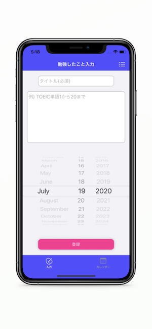

# 復習サイクル
 
 
 
  
# Features
 
科学的にベストなタイミングで復習ができるように設計しました。  
1. 勉強内容を入力  
2. カレンダーに翌日、7日後、16日後、35日後、62日後にその勉強内容を復習するように表示される
3. セルをタップすると完了状態を管理できる
 
# 仕様
 
* Swift 5
* Xcode 11.5

 
# Pod
 
 * FSCalendar 2.8.1
 * Realm 5.3.1
 * RealmSwift 5.3.1
 * LicensePlist

# App Store

https://apps.apple.com/jp/app/%E5%BE%A9%E7%BF%92%E3%82%B5%E3%82%A4%E3%82%AF%E3%83%AB/id1524236844?l=en
