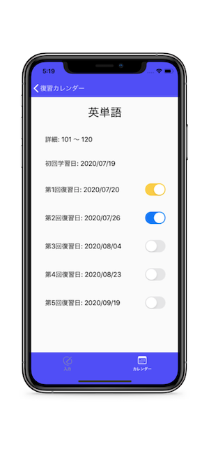

# 復習サイクル
 
 
 
  
# Features
 
科学的にベストなタイミングで復習ができるように設計しました。  
1. 勉強内容を入力  
2. カレンダーに翌日、7日後、16日後、35日後、62日後にその勉強内容を復習するように表示される
3. セルをタップすると完了状態を管理できる
 
# Requirement
 
* Swift 5
* Xcode 11.5
 
# Installation
 
CocoaPodsが必要です。  
インストールの上、ディレクトリを移動し下記コマンドを実行してライブラリをインストールしてください。
 
```bash
pod install
```
